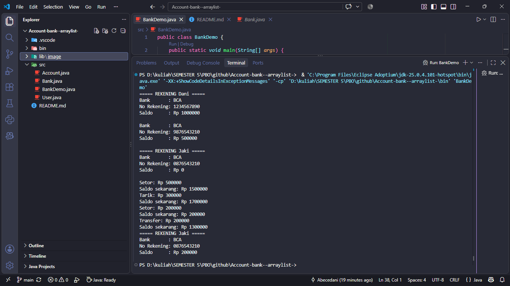

## Library Tambahan

Program ini menggunakan library tambahan dari Java, yaitu:

### `java.util.ArrayList`

`ArrayList` digunakan untuk menyimpan banyak objek `Account` yang dimiliki oleh seorang `User`.

Import yang digunakan:

```java
import java.util.ArrayList;
```

Berbeda dengan array biasa (`Account[]`), `ArrayList` memiliki ukuran yang dapat bertambah secara dinamis. Jadi, jumlah rekening yang dimiliki oleh user tidak harus ditentukan sejak awal.

Contohnya:

```java
private ArrayList<Account> accounts;
```

Kemudian `ArrayList` dibuat pada constructor:

```java
accounts = new ArrayList<>();
```

Untuk menambahkan rekening:

```java
accounts.add(account);
```

Untuk mengakses rekening berdasarkan index:

```java
accounts.get(0);
```

Untuk mengetahui jumlah rekening:

```java
accounts.size();
```

### Alasan Menggunakan `ArrayList`

`ArrayList` digunakan karena satu `User` dapat memiliki lebih dari satu rekening. Dengan `ArrayList`, rekening dapat ditambahkan secara dinamis tanpa harus menentukan jumlah rekening terlebih dahulu.

Struktur hubungan objek dalam program:

```text
                 Bank
          ┌────────┼─────────┐
          │        │         │
         BCA    Mandiri     BNI
          │        │         │
          │        │         │
       Account  Account   Account
          │        │         │
          ▼        ▼         ▼
        Dani     Akbar      Ikky
        jaki
```

Dalam struktur tersebut:

* `User` dapat memiliki banyak `Account`.
* Setiap `Account` memiliki satu `Bank`.
* Satu `Bank` dapat digunakan oleh beberapa `Account`.
* `ArrayList<Account>` digunakan pada `User` untuk menyimpan seluruh rekening yang dimiliki user.

### Contoh Penggunaan di Dalam Kode

```java
User dani = new User("Dani");
User jaki = new User("Jaki");

Account bca1 = new Account("1234567890", bca, 1000000);
Account bca2 = new Account("9876543210", bca, 500000);
Account bca3 = new Account("0876543210", bca, 0);


dani.tambahAccount(bca1);
dani.tambahAccount(bca2);
jaki.tambahAccount(bca3);
```

Dengan menggunakan `ArrayList`, objek `Account` dapat ditambahkan ke dalam `User` menggunakan method `add()` tanpa menentukan batas jumlah rekening di awal.

## Contoh output:

